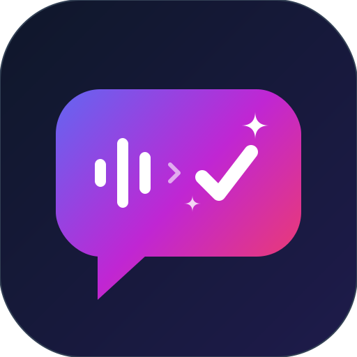

<p align="center">
  
</p>

<h1 align="center">VibeWhisper</h1>

<p align="center">
  <b>Don't type, just speak.</b><br/>
  An open-source, AI-powered voice-to-text engine that transforms your speech into clear, perfectly formatted text in any application. The open-source alternative to Wispr Flow.
</p>

<p align="center">
  <a href="#overview">Overview</a> •
  <a href="#key-features">Key Features</a> •
  <a href="#use-cases">Use Cases</a> •
  <a href="#installation">Installation</a> •
  <a href="#development">Development</a>
</p>

---

## 🌟 Overview

**VibeWhisper** is a cross-platform (macOS, Windows) intelligent voice-to-text assistant. Our core mission is to empower you to write at the speed of thought. By leveraging advanced AI models—like Whisper for lightning-fast transcription and cloud LLMs for intelligent context treatment—VibeWhisper dictates perfectly crafted text directly into any active window or text field across your operating system.

## ✨ Key Features

* ⚡ **4x Faster Than Typing:** Reach speeds of up to 220 words per minute (wpm), allowing you to express complex ideas at your natural speaking pace, completely bypassing the physical keyboard bottleneck (average 45 wpm).
* 🤖 **AI-Powered Edits:** VibeWhisper transcribes and edits your voice instantly. Scattered, unstructured thoughts are seamlessly transformed into clear, perfectly formatted text, automatically removing filler words ("um", "uh") and speech disfluencies.
* 📖 **Personal Dictionary:** The AI learns your unique vocabulary—names, technical jargon, acronyms—and ensures they are automatically recognized and transcribed correctly.
* ⚡ **Snippet Library (Voice Shortcuts):** Create custom voice commands for repetitive texts. Say "my calendar link" and the AI will type out the full URL and scheduling message instantly.
* 🎭 **Tone Adjustment:** Automatically adjusts the tone of the written output based on the application you are currently using, maintaining a natural voice while avoiding robotic phrasing.
* 🌍 **100+ Languages:** Automatically detects and transcribes in your language, making it effortless to seamlessly switch between multiple languages on the fly.
* 🔄 **Cross-Platform Sync:** Your configurations, dictionary, and personal style are synchronized whether you are taking notes on the go via your mobile or sitting at your desktop.

## 🎯 Use Cases (Who is this for?)

VibeWhisper is built to accelerate the workflows of professionals and creatives:

* **Accessibility:** An essential tool for users who feel restricted, slow, or have physical difficulties using traditional keyboards.
* **Content Creators:** Quickly draft ideas, scripts, respond to DMs, and reply to comments naturally.
* **Customer Support:** Resolve tickets up to 4x faster without relying on rigid, robotic scripts.
* **Developers:** Dictate in natural language and let the AI translate it into git commit messages, code reviews, or comments in IDEs like Cursor or VS Code.
* **Lawyers & Medical Professionals:** Seamlessly dictate contract clauses, case notes, and patient records.
* **Leaders & Managers:** Quickly align teams, draft updates, and reduce meeting times by communicating async via voice.
* **Sales Teams:** Draft instantaneous post-meeting follow-ups and personalized emails while walking out of the client's office.
* **Students:** Capture lecture notes and effortlessly break writer's block for essays and assignments.

---

## 💻 Tech Stack

* **Framework:** [Flutter](https://flutter.dev/) (macOS, Windows, iOS, Android)
* **Audio Processing:** `record` plugin
* **Transcription:** [Groq API](https://groq.com/) (using `whisper-large-v3-turbo`)
* **LLM Treatment:** Open-source models (e.g., LLaMA-3, Mixtral)
* **Desktop Integration:** `window_manager`, `hotkey_manager`, and global keyboard emulators (`keypress_sim`) for instant cross-app auto-pasting.

---

## 🚀 Installation & Setup

### Prerequisites
* A machine running macOS 10.14+ (or corresponding supported Windows/Linux environment).
* (For Development) Flutter SDK installed.

### Installing the macOS Release

1. **Download the App:** Find the generated installer inside the `macos/installer` folder of this repository (`macos/installer/install.dmg`).
2. **Mount the DMG:** Double-click the `install.dmg` file. A window will appear with the VibeWhisper app and a shortcut to your Applications folder.
3. **Install:** Drag and drop the **VibeWhisper** icon into the **Applications** folder shortcut.
4. **Launch:** Open your `Applications` folder or use Spotlight (`Cmd + Space`) to search for **VibeWhisper**.

> **Note on macOS Security:** Because this open-source build may not be codesigned with an Apple Developer Certificate, macOS might show an "unverified developer" warning. 
> To bypass: Go to **System Settings > Privacy & Security**, scroll to **Security**, and click **Open Anyway** next to the VibeWhisper warning. You only need to do this the first time.

---

## 🛠️ Development & Building

If you wish to contribute or build the application from source, follow these steps:

### 1. Generate the Release Build
From the root of the project, run:
```bash
flutter build macos --release
```

### 2. Package into a DMG (macOS)
Ensure you have the `appdmg` package installed globally via npm:
```bash
npm i -g appdmg
```

Navigate to the installer directory and generate the DMG:
```bash
cd macos/installer
appdmg appdmg.json install.dmg
```

### 3. Modifying the Installer Background
To customize the visual background of the macOS installer:
1. Edit the vector graphic in `macos/installer/background.svg`.
2. Convert it to PNG using macOS QuickLook:
   ```bash
   qlmanage -t -s 600 -o . background.svg && mv background.svg.png background.png
   ```
3. Re-run the `appdmg` step to regenerate `install.dmg` with the updated visuals.

---

<p align="center">
  Built with ❤️ using Flutter and Groq.
</p>
